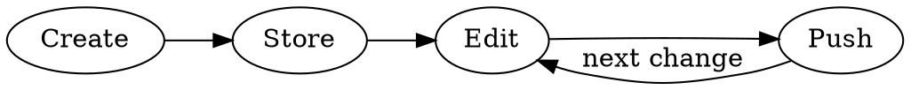

# GAS Workflow

Four phases: **Create → Store → Edit → Push**. Each phase has decision points —
never assume defaults silently. At every decision, check memory first: if the
user answered this before, use their saved preference and confirm briefly
("Using your GitHub + clasp setup from last time — still good?").



---

## Memory Integration

**After each decision point**, save the user's choice so future sessions skip
redundant questions:

| Decision | Memory type | Key info to save |
|----------|-------------|------------------|
| Storage preference | project | local / GitHub / both |
| Push identity | project | Claude pushes vs user pushes |
| Script ID | project | the scriptId value |
| GitHub repo URL | project | repo URL |
| Timezone | user | timezone string |
| Commit attribution | feedback | whether user wants Co-Authored-By tags |

**Returning users:** If memories exist, skip to Phase 3 and confirm saved
settings in one line instead of re-asking.

---

## Prerequisites (silent)

Check silently, only surface failures:

```bash
node --version && clasp --version && git --version && gh auth status
```

- Missing `clasp` → offer `npm install -g @google/clasp`
- No `~/.clasprc.json` → tell user to run `clasp login` in their terminal.
  **Never run `clasp login` yourself** — requires browser OAuth.

---

## Phase 1: Create

### 1.1 — Folder

> Dedicated folder for this project, or current directory?

Dedicated → kebab-case name (e.g., `gas-invoice-generator/`).

### 1.2 — Project type

Ask: standalone, sheets, docs, slides, forms, webapp, or api.

### 1.3 — Initialize

| Scenario | Action |
|----------|--------|
| Existing script | `clasp clone <scriptId> --rootDir .` |
| New project | `clasp create --title "Name" --type <type> --rootDir .` |
| clasp not ready | Scaffold manually, defer clasp to Phase 3 |

Manual scaffold:

```
project-name/
├── appsscript.json
├── Code.gs
```

Default `appsscript.json` — ask timezone if not known from memory:

```json
{
  "timeZone": "America/New_York",
  "dependencies": {},
  "exceptionLogging": "STACKDRIVER",
  "runtimeVersion": "V8"
}
```

---

## Phase 2: Store

### 2.1 — Storage preference

> 1. **Local only**
> 2. **Private GitHub repo only**
> 3. **Both local + private GitHub repo**

Save choice to memory immediately.

### 2.2 — If GitHub involved

**Who pushes?**
> 1. **Claude pushes** — I'll use `gh` to create repo and push
> 2. **User pushes** — I'll prepare commands for you to run

- Claude pushes → `gh repo create <name> --private --source . --remote origin`,
  then init, commit, push.
- User pushes → check `gh auth status`, walk through `gh auth login` if needed,
  then provide copy-pasteable commands.

### 2.3 — .gitignore

Always create:

```
.clasprc.json
node_modules/
.DS_Store
Thumbs.db
.vscode/
.idea/
```

`.clasp.json` — commit by default (helps collaborators). Add to `.gitignore`
only if user considers scriptId sensitive.

---

## Phase 3: Edit / Update

### Smart sync — don't nag

**During rapid iteration** ("try X", "no change Y") → stay quiet, accumulate.

**At natural pauses** ("looks good", "that works", user goes quiet) → then ask:

> Ready to sync? [default action based on their Phase 2 choice]

Default to the user's saved preference. Only list alternatives if they ask.

### clasp setup (if needed)

If `.clasp.json` missing when pushing:

> I need your Script ID — find it at script.google.com → Project Settings.
> Or paste the script URL.

Write `.clasp.json`, save scriptId to memory.

### clasp push safety

**Always suggest `clasp pull` first** if the project may have been browser-edited.
`clasp push` overwrites the remote — warn clearly, especially with collaborators.

---

## Phase 4: Push Discipline

### Rules (always enforced)

1. **No silent pushes.** Confirm before pushing anywhere.
2. **Meaningful commit messages.** Conventional format:
   `<type>(<scope>): <description>` — types: feat, fix, refactor, docs, style, chore.
3. **Show changes before committing** — list changed files + proposed message, get OK.
4. **clasp push = production.** Warn it overwrites script.google.com.
5. **No secrets** — scan for API keys, tokens, credentials before committing.
6. **Respect attribution preferences** from memory — no Co-Authored-By unless user wants it.
7. **Suggest `clasp pull` before `clasp push`** to avoid overwriting browser edits.

---

## clasp Quick Reference

| Command | Purpose |
|---------|---------|
| `clasp login` | Auth with Google (browser) |
| `clasp create --title "X" --type sheets` | New project |
| `clasp clone <scriptId>` | Download existing |
| `clasp pull` | Remote → local |
| `clasp push` | Local → remote (overwrites!) |
| `clasp push --watch` | Auto-push on save |
| `clasp open` | Open in script editor |
| `clasp deploy` | Versioned deployment |
| `clasp version "desc"` | Immutable version snapshot |

---

## Edge Cases

**TypeScript** — clasp supports TS natively. Use `.ts` files, transpiles on push.

**Existing project** — skip Phase 1, `clasp clone`, pick up at Phase 2.

**Multiple environments** — dev: push directly; staging: `clasp version` + deploy;
prod: deploy a tested version.

**No clasp** — skip all clasp steps, local + GitHub only. Still enforce git discipline.
